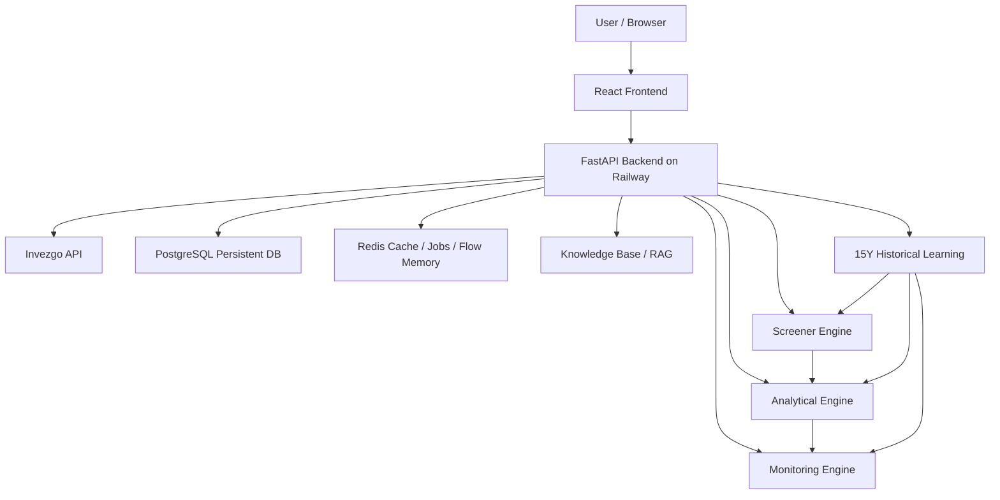

# MASTER TERMINAL ARCHITECTURE - BISMILLAH SUPER TRADING TERMINAL

Tanggal: 2026-05-26
Scope: Screener, Analytical, Monitoring, Money Maker Core, Official Invezgo Enrichment, 15Y Historical Memory, persistent storage, dan deployment Railway.

## 1. Executive Summary

Terminal sudah terintegrasi secara end-to-end:

- Screener menghasilkan kandidat IDX berdasarkan mode swing, intraday, dan scalping.
- Screener membawa context penuh ke Analytical, termasuk grade, score, money maker, top gainer lane, watchlist/radar flags, dan official enrichment.
- Analytical membaca context Screener, menjalankan engine sendiri, lalu menyelaraskan hasil menjadi GO, WAIT, CONDITIONAL, WATCHLIST RADAR, atau NO GO.
- Monitoring menerima action plan dari Analytical dan membawa semua warning aktif: trigger, invalidation, opportunity mode, screener alignment, official Invezgo, money maker, orderbook, dan empirical memory.
- 15Y Historical Memory sudah hidup untuk sebagian ticker dan sudah menghasilkan empirical patterns awal.
- Persistent storage sudah memakai PostgreSQL/Redis cloud, sehingga data tidak hilang ketika laptop mati.

Catatan penting:

- Full 500 ticker historical sync sempat dijalankan di Railway, tetapi berhenti karena PostgreSQL penuh: `No space left on device`.
- Artinya integrasi benar, tetapi kapasitas database harus dinaikkan atau strategi storage harus dioptimalkan sebelum full-universe 15Y memory selesai.

## 2. Production Health Snapshot

Backend production:

- URL: `https://backend-production-daed.up.railway.app`
- Health: OK
- Engines: 35
- KB loaded: true
- Redis: true

Historical learning status terakhir:

- OHLCV 15Y sudah tersedia untuk beberapa ticker besar seperti SMGR, SCMA, TLKM, UNVR, ACES, BMRI, BYAN, ADRO, BBCA, ANTM.
- Range contoh: 2011-05-26 sampai 2026-05-25.
- Empirical patterns:
  - Intraday: 43 patterns
  - Swing: 43 patterns

Bulk sync job:

- Job id: `f8a6f4fa`
- Target: 500 tickers, 15 years, force=false, concurrency=2.
- Status: error
- Cause: PostgreSQL disk full.

## 3. High Level Architecture

## 4. Data Sources

### 4.1 Invezgo Official Data

Dipakai untuk:

- Stock list
- OHLCV daily
- Intraday data
- Top gainer / top mover
- Time table
- Momentum chart
- Intraday inventory
- Broker summary / broker stalker
- Orderbook
- Corporate action
- Key stats
- Sector rotation / sector stalker

Policy hemat token:

- Fetch official enrichment hanya saat diperlukan.
- Screener fetch top-flow/sector once per run.
- Multi-timeframe hanya untuk final/top candidates.
- Historical data disimpan permanen setelah sync agar tidak perlu download ulang.
- `force=false` untuk historical sync agar data lama tidak ditarik ulang.

### 4.2 PostgreSQL Persistent Store

Dipakai untuk:

- `ohlcv_daily`: candle harian 15 tahun.
- `historical_features`: fitur pattern historis.
- `historical_outcomes`: outcome TP/SL/time horizon.
- `empirical_patterns`: aggregate sample, winrate, expectancy, confidence.
- Money maker cloud memory jika backend configured.

Current issue:

- Full historical sync membutuhkan storage lebih besar.
- Job terakhir gagal karena PostgreSQL disk full.

### 4.3 Redis

Dipakai untuk:

- Health / cache
- Job status historical learning
- Monitoring active positions
- Flow memory support

### 4.4 Knowledge Base

Dipakai untuk:

- RAG context per engine
- Bandarmology / IDX trading references
- Empirical literature injection jika tersedia

## 5. Screener Architecture

Endpoint utama:

- `POST /api/screener/run`

Input penting:

- `mode`: swing, intraday, scalping
- `filter_intensity`: 100, 75, 50
- `limit`
- `include_debug`

Core stages:

1. Build universe:
   - Official stock list
   - Tier 0 / Tier 1 / Tier 2
   - Top gainer lane from Invezgo
   - Warrant/right filtering

2. Liquidity gate:
   - Value
   - Frequency
   - Tier discount
   - Top gainer liquidity fallback if official data missing

3. OHLCV prefilter:
   - Price range
   - Volume validity
   - RVOL
   - Change percent
   - MA location
   - Intraday freshness
   - ARA/ARB risk

4. Scoring:
   - 35 engine composite
   - Bandarmology
   - Foreign flow
   - Money Maker Core
   - Pattern score
   - KB/empirical boost

5. Disqualifier:
   - Distribution/decline
   - Heavy foreign sell
   - Money Maker FLOW_OUT_AVOID
   - Score below mode threshold
   - No-chase top gainer radar

6. Fallback:
   - If strict screener empty, build adaptive watchlist.
   - Fallback is observation only, not entry.
   - No-chase top gainer cannot enter fallback.

## 6. Top Gainer Policy

Purpose:

- Capture opportunity without chasing market order.

Rules:

- 5 percent to below 10 percent:
  - `Top Gainer Sweet Spot`
  - May enter execution review.
  - Analytical can convert to `CONDITIONAL_BUY_STOP`.

- 10 percent to below 20 percent:
  - `EXTENDED_TOP_GAINER_NO_CHASE`
  - Radar only.
  - Wait reset/base.

- 20 percent and above:
  - `EXTREME_TOP_GAINER_NO_CHASE`
  - Extension / ARA risk radar.
  - Not qualified for main execution list.

Important protection:

- `radar_only` and `no_chase_radar` are excluded from qualified list and fallback list.

## 7. Analytical Architecture

Endpoint utama:

- `POST /api/analytic/analyze`

Input:

- `ticker`
- `mode`
- `screener_context`

Analytical modules:

- Realtime price injection
- 35 engine master runner
- Market regime
- Trend/MA/range setup
- Bandarmology
- Broker concentration
- Value inflow
- Foreign flow
- Price distribution
- Orderbook execution overlay
- Official Invezgo enrichment
- Money Maker Core
- 15Y Historical Memory
- KB/RAG context

Main alignment rules:

### 7.1 Normal Analytical Decision

Can return:

- `GO`
- `STRONG GO`
- `WAIT`
- `NO GO`

### 7.2 Screener Opportunity Alignment

If Screener sends top gainer sweet spot 5 to 10 percent:

- Convert from raw NO LONG ENTRY to:
  - `TOP_GAINER_CONDITIONAL_EXECUTION`
  - `CONDITIONAL_BUY_STOP`

If above 10 percent:

- Convert to:
  - `WATCHLIST_RADAR`
  - No chase

### 7.3 Screener Candidate Alignment

If Screener Grade A/B and score >= 55:

- Analytical must not output raw `NO_LONG_ENTRY` unless fatal risk exists.
- If risk is mixed but not fatal:
  - `SCREENER_QUALIFIED_WAIT_CONFIRMATION`
  - `WAIT_CLOSE_CONFIRMATION`

Fatal risks still override:

- Money Maker `FLOW_OUT_AVOID`
- Retail exit liquidity
- Climax distribution risk
- BFD flow reversal
- Severe distribution trap

## 8. Monitoring Architecture

Endpoints:

- `POST /api/monitoring/start`
- `POST /api/monitoring/check`
- `GET /api/monitoring/status/{monitoring_id}`
- `GET /api/monitoring/active`

Inputs from Analytical:

- Entry price
- Stop loss
- TP1/TP2/TP3
- Mode
- Engine scores
- Market regime
- Analytical context
- Action plan
- Orderbook execution
- Official enrichment
- Money maker
- Opportunity/watchlist/screener alignment
- Empirical memory

Monitoring warnings:

- Action plan invalidation
- Trigger not confirmed
- Opportunity watch active
- Opportunity trigger pending/touched
- Watchlist radar observation
- Screener qualified analytic wait
- Money Maker flow out
- BFD reversal
- Official Time Table sell pressure
- Momentum sell bias
- Corporate action context
- Volume spike / dry volume
- Empirical weak/support warning

Monitoring rule:

- Monitoring is only meaningful after there is an executable or conditional plan.
- Watchlist/radar states are displayed as warning context, not automatic entry.

## 9. 15Y Historical Memory

Endpoint group:

- `/api/historical-learning/*`

Tables:

- `ohlcv_daily`
- `historical_features`
- `historical_outcomes`
- `empirical_patterns`

Flow:

1. Sync 15Y OHLCV to PostgreSQL.
2. Build per-ticker historical features.
3. Label outcomes based on mode:
   - Scalping: short horizon
   - Intraday: 3-day horizon
   - Swing: 20-day horizon
4. Mine empirical patterns.
5. Analytical and Monitoring read matching pattern context.

Current working state:

- Date query/write bug fixed.
- Intraday and swing empirical patterns created.
- Full 500 ticker job blocked by DB disk capacity.

Recommendation:

- Upgrade PostgreSQL storage before full sync.
- Or optimize storage:
  - Keep `ohlcv_daily` full.
  - Aggregate `historical_features/outcomes` by pattern and ticker batch.
  - Archive raw feature JSON if storage pressure grows.

## 10. Decision State Matrix

| State | Screener | Analytical | Monitoring |
|---|---|---|---|
| Normal GO | Qualified high score | GO/STRONG GO | Active monitoring allowed |
| Qualified but mixed risk | Grade A/B, score >=55 | WAIT_CLOSE_CONFIRMATION | Warning context |
| Top gainer 5-10 | Sweet spot | CONDITIONAL_BUY_STOP | Opportunity Watch |
| Top gainer 10-20 | Extended | WATCHLIST_RADAR | No-chase radar |
| Top gainer 20+ | Extreme | WATCHLIST_RADAR | Extension/ARA risk |
| Bad market empty strict | Adaptive watchlist | WATCHLIST_RADAR | Observation only |
| Fatal money maker risk | Disqualified | NO_LONG_ENTRY | Defensive warning |

## 11. File Map

Backend:

- `backend/app/api/screener.py`
  - Universe, prefilter, scoring, top gainer policy, no-chase gate.

- `backend/app/api/analytic.py`
  - Analytical decision, action plan, screener alignment, opportunity alignment.

- `backend/app/api/monitoring.py`
  - Position monitoring, warning extraction, active context.

- `backend/app/core/official_enrichment.py`
  - Official Invezgo enrichment for Screener/Analytic/Monitoring.

- `backend/app/core/money_maker.py`
  - Money Maker Core, BFD, flow memory, risk flags, execution stance.

- `backend/app/core/money_maker_store.py`
  - Persistent flow memory.

- `backend/app/ml/historical_learning.py`
  - 15Y OHLCV sync, feature extraction, outcome labeling, pattern mining.

- `backend/app/api/historical_learning.py`
  - Historical learning API and background jobs.

Frontend:

- `frontend/src/components/screener/ScreenerPage.jsx`
  - Filter intensity, candidate cards, top gainer sweet spot, no-chase radar.

- `frontend/src/components/analytic/AnalyticPage.jsx`
  - Trade setup, opportunity/watchlist/screener alignment, 15Y memory.

- `frontend/src/components/monitoring/MonitoringPage.jsx`
  - Active positions, action plan context, warnings, empirical memory.

- `frontend/src/stores/useStore.js`
  - Cross-tab context handoff.

## 12. Deployment

Backend:

- Railway
- Production URL: `https://backend-production-daed.up.railway.app`

Frontend:

- Local Vite during development
- Browser currently uses `http://127.0.0.1:5173/`

Persistence:

- PostgreSQL and Redis in cloud.
- Laptop sleep does not delete persisted data.
- Long-running cloud jobs continue only if Railway worker/server and database capacity are healthy.

## 13. Known Risks

1. PostgreSQL disk capacity
   - Current largest blocker for full 500 ticker 15Y memory.

2. Invezgo token/quota
   - Must keep `force=false`.
   - Use incremental sync.
   - Avoid repeated full historical downloads.

3. UI interpretation risk
   - Screener score is not entry signal.
   - Analytical is final validation.
   - Monitoring is only active after conditional/executable action plan.

4. Intraday data limitation
   - 15Y memory currently uses daily OHLCV derived patterns.
   - It supports intraday/swing decisions statistically, but is not a replacement for live orderbook/time table.

## 14. Next Recommended Work

Priority 1:

- Upgrade Railway PostgreSQL storage or implement compact historical aggregate storage.

Priority 2:

- Add Historical Learning dashboard:
  - Coverage per ticker
  - Rows per ticker
  - Last sync date
  - Pattern counts by mode
  - Disk/storage warning

Priority 3:

- Add separate `No-Chase Radar` panel so extreme movers are visible but never mixed with execution candidates.

Priority 4:

- Add automatic daily incremental sync after market close:
  - Pull only latest candles
  - Re-mine empirical patterns incrementally
  - No full resync unless explicitly requested

## 15. Current Integration Verdict

Integrated: yes.

Safe enough for current workflow: yes, with one infrastructure caveat.

Infrastructure caveat:

- Full 15Y all-ticker learning needs more PostgreSQL disk or compact storage strategy.

Trading caveat:

- Screener is candidate/radar.
- Analytical is validation and action plan.
- Monitoring is active risk management.

